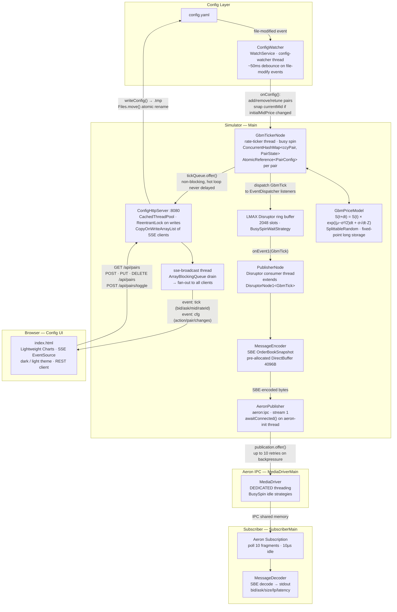

# replicatorFX

A low-latency FX rates simulator that publishes `OrderBookSnapshot` messages over [Aeron](https://github.com/real-logic/aeron) IPC using [SBE](https://github.com/real-logic/simple-binary-encoding) encoding. Rates follow Geometric Brownian Motion (GBM), are hot-reloadable via a watched config file, and the internal pipeline is built on [Conduit](https://github.com/green-leaves/conduit) (LMAX Disruptor-backed event processing). A built-in HTTP config UI lets you add, edit, and toggle pairs live at `http://localhost:8080`.

## Features

- **GBM price model** — per-pair tunable drift (μ), volatility (σ), spread, and tick rate
- **Sub-millisecond tick rates** — `tickIntervalMs` is a `double`; set `0.5` for 2 ticks/ms per pair
- **SBE wire format** — `OrderBookSnapshot` messages encoded with zero-allocation SBE codecs
- **Aeron IPC transport** — all pairs multiplexed on a single stream
- **Conduit pipeline** — LMAX Disruptor ring buffer decouples tick generation from Aeron publishing; new processing stages (filters, spike injectors) slot in as additional nodes
- **Hot-reload config** — edit `config.yaml` or use the UI to add, remove, or retune pairs instantly; changing `initialMidPrice` snaps the running simulation to the new value immediately
- **Config UI** — embedded HTTP server with SSE live-tick streaming, Lightweight Charts, and a full REST CRUD API for pair management
- **Built-in subscriber** — `SubscriberMain` decodes and prints live rates for verification

## Requirements

- Java 21
- Gradle 9+
- Aeron MediaDriver running as a standalone process

## Build

```bash
gradle build
```

SBE codec classes are generated automatically from `src/main/resources/sbe/fx-rates.xml` into `build/generated-sources/sbe/` before compilation.

## Running

Start the three components in separate terminals:

**1. Aeron MediaDriver** (must be started first)
```bash
gradle run -PmainClass=com.replicatorfx.MediaDriverMain
```

**2. Simulator**
```bash
gradle run
```

The config UI is available at `http://localhost:8080` immediately — it starts before Aeron connects.

**3. Subscriber** (optional — prints decoded rates to stdout)
```bash
gradle run -PmainClass=com.replicatorfx.SubscriberMain
```

Pass a custom config path as the first argument:
```bash
gradle run --args="path/to/my-config.yaml"
```

## Configuration

`config.yaml` controls everything. The simulator watches this file and applies changes within ~50ms of a save — no restart needed. The Config UI writes this file directly; manual edits and UI edits are equivalent.

```yaml
aeron:
  channel: "aeron:ipc"
  streamId: 1

global:
  fixSession:   "FX-SIM-SESSION"
  takerCompID:  "TAKER001"
  senderCompID: "SENDER001"
  sourceSystem: "REPLICATORFX"

pairs:
  - ccyPair:         "EUR/USD"   # 7-char currency pair (char[7])
    instrument:      "SPOT"      # up to 10 chars (char[10])
    lpName:          "SIMLP1"    # liquidity provider name
    initialMidPrice: 1.08500     # snaps the running mid immediately when changed
    decimalPlaces:   5
    volatility:      0.005       # annualised σ (e.g. 0.005 = 50 bps/year)
    drift:           0.0001      # annualised μ (directional bias)
    spreadPips:      2.0         # bid/ask spread in pips
    pipSize:         0.00001
    tickIntervalMs:  0.5         # 0.5ms = 2 ticks/ms; use 1.0 for 1ms, 100.0 for 100ms
    bidSize:         1000000.0
    askSize:         1000000.0
    enabled:         true
```

### Tick rate reference

| `tickIntervalMs` | Ticks/ms per pair | Ticks/sec (10 pairs) |
|---|---|---|
| `0.5` | 2 | 20,000 |
| `1.0` | 1 | 10,000 |
| `10.0` | 0.1 | 1,000 |
| `100.0` | 0.01 | 100 |

## Architecture



### Threading model

| Thread | Role |
|---|---|
| `rate-ticker` | GBM spin loop; produces `GbmTick` into the Disruptor ring buffer and the HTTP tick queue |
| Disruptor consumer | Single thread; SBE encodes and calls `publication.offer()` |
| `sse-broadcast` | Drains the tick queue; fans out SSE frames to all connected browser clients |
| HTTP executor | Cached thread pool; handles REST requests, holds one thread per SSE client |
| `config-watcher` | Blocks on `WatchService.take()`; calls `tickerNode::onConfig` on file change |
| `aeron-init` | Daemon; blocks in `awaitConnected()` until a subscriber joins, then wires the Disruptor pipeline |
| `shutdown-hook` | Sets `running = false`; closes ticker, publisher, and HTTP server |

### Config UI — REST API

| Method | Path | Description |
|---|---|---|
| `GET` | `/api/pairs` | List all pairs |
| `POST` | `/api/pairs` | Add a new pair |
| `PUT` | `/api/pairs` | Update an existing pair |
| `DELETE` | `/api/pairs?pair=EUR/USD` | Remove a pair |
| `POST` | `/api/pairs/toggle?pair=EUR/USD` | Toggle enabled / paused |
| `GET` | `/events` | SSE stream (`tick` and `cfg` events) |

All write operations update `config.yaml` atomically (write to `.tmp`, then rename). The `ConfigWatcher` picks up the change and hot-reloads the ticker within ~50ms, completing the round-trip: UI edit → YAML → watcher → ticker.

### Extending the pipeline

To add a processing stage (e.g. a rate spike injector or mid-price filter), create a new `DisruptorNode1<GbmTick>` that also implements `EventDispatcher<GbmTick>`, then insert it in `Main`:

```java
SpikeInjectorNode spikeNode = new SpikeInjectorNode();
spikeNode.subscribe1(tickerNode);    // receives from ticker
spikeNode.start();

publisherNode.subscribe1(spikeNode); // forwards to publisher
publisherNode.start();
```

No changes to `GbmTickerNode` or `PublisherNode` are required.

## SBE Message Schema

**Message:** `OrderBookSnapshot` (template id=6)

| Field | Type | Notes |
|---|---|---|
| `seqId` | uint64 | `System.nanoTime()` at encode — unique per message |
| `sendingTime` | uint64 | epoch nanos at publish |
| `processTime` | uint64 | epoch nanos at GBM tick generation |
| `instrument` | char[10] | from config, null-padded |
| `tenor` | char[10] | always `"SP"` (spot) |
| `forward` | BooleanType | always `FALSE` |
| `ccyPair` | char[7] | e.g. `"EUR/USD"` |
| `lastUpdateTimeStamp` | uint64 | epoch nanos |
| `isModifiedByInvoke` | BooleanType | always `FALSE` |
| `pipSize` | double | from config |
| `bids` group (1 entry) | — | GBM mid − spread/2 |
| `asks` group (1 entry) | — | GBM mid + spread/2 |
| `fixSession` | varString | from global config |
| `takerCompID` | varString | from global config |
| `senderCompID` | varString | from global config |
| `sourceSystem` | varString | from global config |
| `valueDate` | varString | T+2 business days (YYYYMMDD) |
| `traceId` | varString | UUID per message |

Each bid/ask group entry contains: `price`, `size`, `tradeable=TRUE`, `valueDate`, `lpName`, `entryId` (UUID).

## Price Model

Each tick applies the GBM formula:

```
S(t+dt) = S(t) × exp( (μ − σ²/2) × dt  +  σ × √dt × Z )
```

where `Z ~ N(0,1)` and `dt = tickIntervalMs / (365 × 24 × 3,600,000)` (time step in years).

Prices are stored as fixed-point `long` integers scaled by `10^decimalPlaces` (e.g. `108500` = 1.08500 with `decimalPlaces=5`) to avoid floating-point accumulation drift. Conversion to/from `double` happens only at GBM calculation and at SBE encode time.

**JPY pairs** use `pipSize=0.01` and `decimalPlaces=3`; XAU/USD uses `decimalPlaces=2`.

### Tuning volatility for visible pip movement

Per-tick price standard deviation: `σ_tick = S × σ × √dt`

Working backwards from a target pip movement per tick: `σ = (pips × pip_size) / (√dt × S)`

| `tickIntervalMs` | Target pips/tick | EUR/USD `volatility` | GBP/USD `volatility` | USD/JPY `volatility` |
|---|---|---|---|---|
| `100.0` | ~0.5 pip | `0.08` | `0.10` | `0.08` |
| `100.0` | ~1.0 pip | `0.16` | `0.20` | `0.16` |
| `100.0` | ~2.0 pip | `0.33` | `0.40` | `0.32` |
| `1.0` | ~0.5 pip | `0.82` | `1.02` | `0.80` |
| `0.5` | ~0.5 pip | `1.16` | `1.44` | `1.13` |

Real-world annualised vol: EUR/USD ~8%, GBP/USD ~10%, USD/JPY ~8%. Scale by `√(100 / tickIntervalMs)` when changing tick rate to preserve pip-per-tick magnitude.

### Tuning drift for directional trends

Drift accumulates over minutes, not individual ticks. Use it to simulate a sustained trend:

| `drift` | Effect |
|---|---|
| `0.0` | Flat / mean-reverting |
| `0.05` | Gradual uptrend (~5% price rise per year) |
| `-0.05` | Gradual downtrend |
| `0.5` | Aggressive uptrend — visible within minutes |

## Dependencies

| Library | Version | Purpose |
|---|---|---|
| [Aeron](https://github.com/real-logic/aeron) | `1.44.1` | IPC transport |
| [SBE](https://github.com/real-logic/simple-binary-encoding) | `1.30.0` | Binary message encoding |
| [Conduit](https://github.com/green-leaves/conduit) (vendored) | — | Disruptor-backed event pipeline |
| [LMAX Disruptor](https://github.com/LMAX-Exchange/disruptor) | `4.0.0` | Ring buffer (via Conduit) |
| [SnakeYAML](https://bitbucket.org/snakeyaml/snakeyaml) | `2.2` | Config file parsing |
| [Jackson Databind](https://github.com/FasterXML/jackson) | `2.17.2` | REST API JSON serialisation |
| [Agrona](https://github.com/real-logic/agrona) | (via Aeron) | Off-heap buffers |

Conduit source is vendored under `io.lightning.conduit` — no external Maven dependency required.
